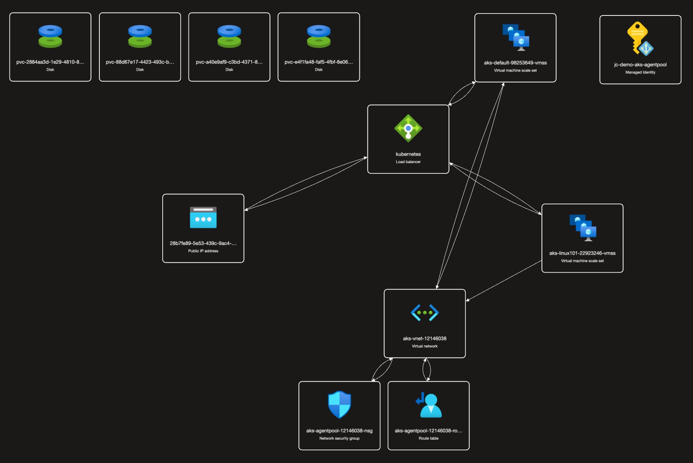

# Azure Kubernetes Service and Node Pool demo

## Justification

The purpose of this demo is to show power of the cloud, combined with Terraform, which is an infrastructure of code tool that helps us to provision and maintain cloud resources. During this demo I used Azure Kubernetes Service to deploy an application with the Frontend and Backend.

This demo serves several important purposes, justifying the effort put into its creation:

**1- Efficient Deployment:** By utilizing Terraform, I can define the entire infrastructure needed for this demo in code. 

**2- Reproducibility:** This repository demonstrates how to consistently and accurately reproduce the entire infrastructure environment. 

**3- Version Control:** Building the demo infrastructure in code and hosting it in a repository allows for easy versioning and collaboration. 

**4- Automation Insights:** This demo can be designed to reveal how automated deployment, scaling, and management can greatly enhance operational efficiency and reliability. 

In summary, the creation of this repository using Terraform, Azure, and Azure Kubernetes Service in this demo, is to illustrate the path from initial deployment to horizontal scaling, showing insights into managing real-world scenarios. 

# Terraform State Backend Setup
On the root folder, navigate to the **remote-backend** folder, the refference for the documentation can be found [here](remote-backend/README.MD).

---

# Azure Infrastructure AKS

Documentation for the infrastructure can be found [here](azure-infra/README.MD).